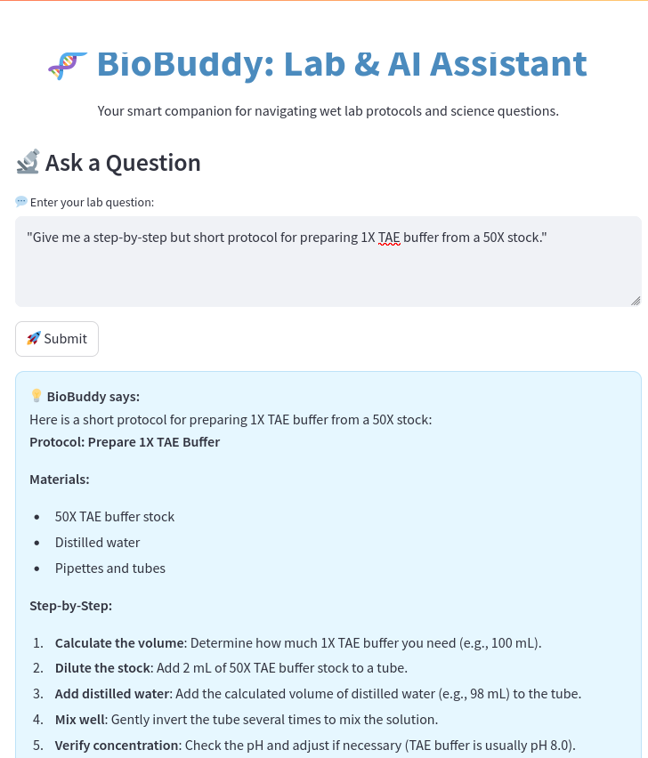
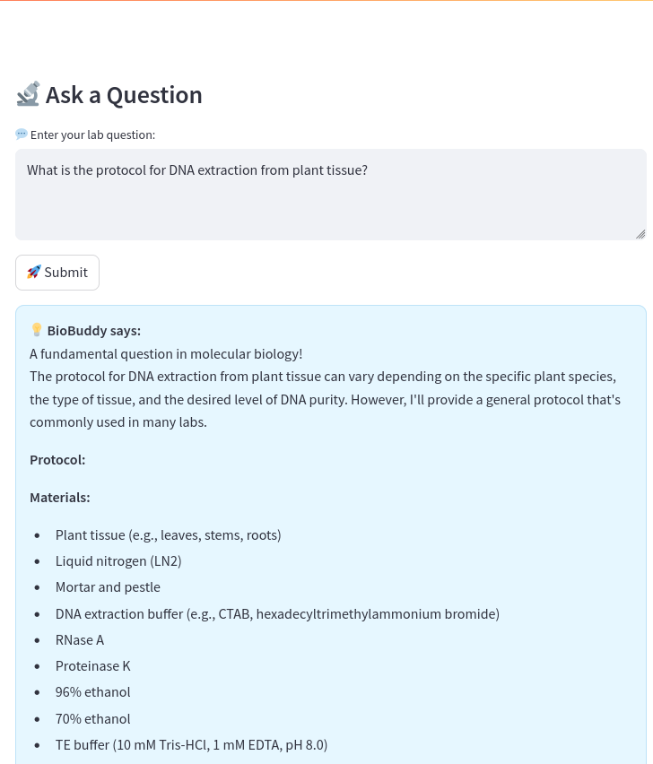
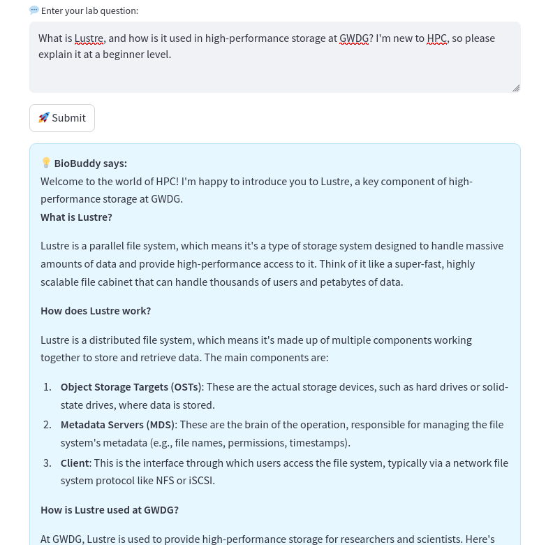
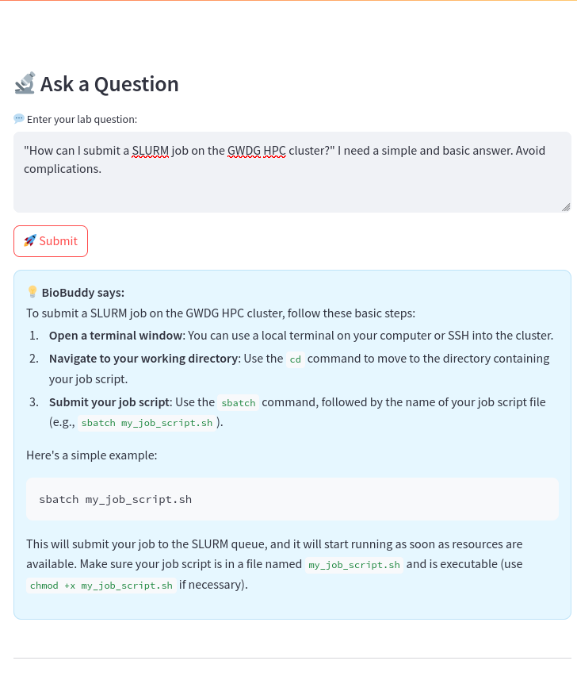
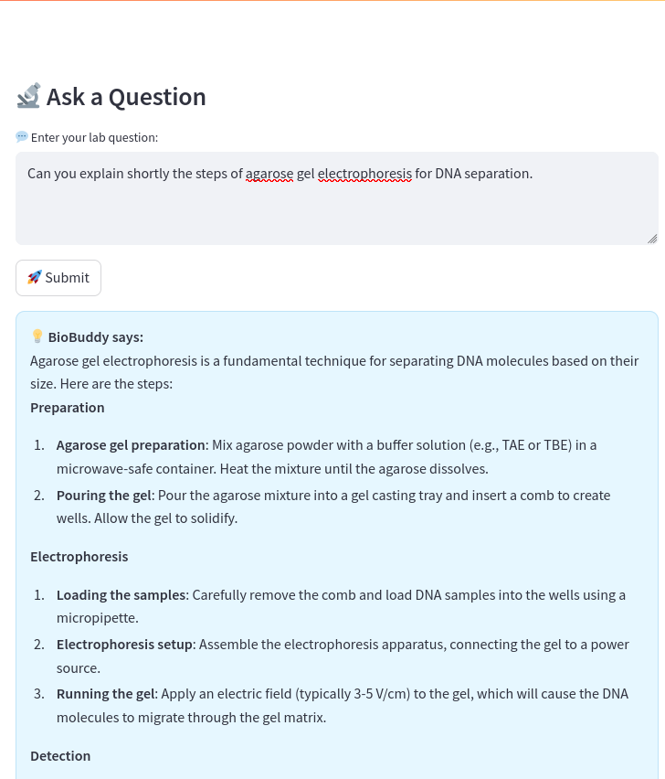
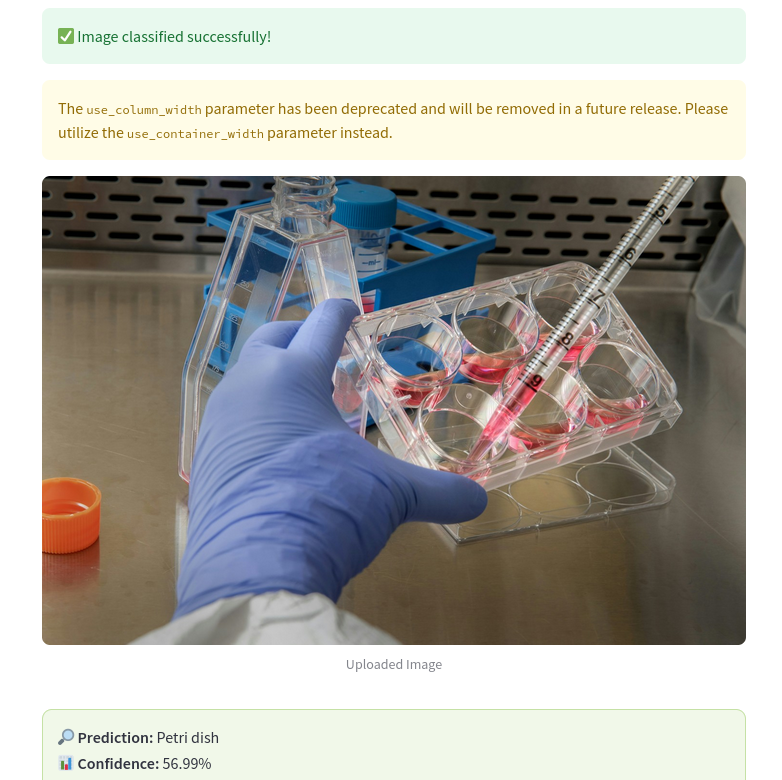
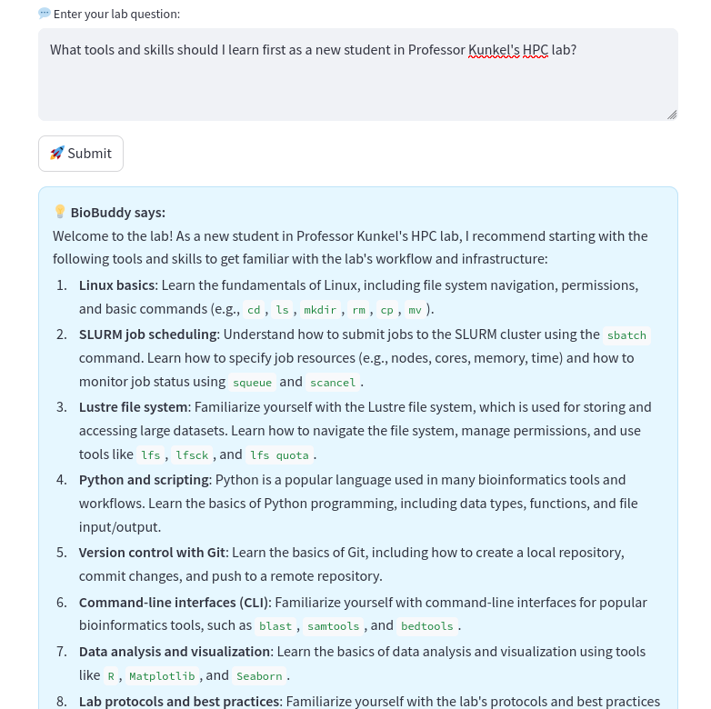
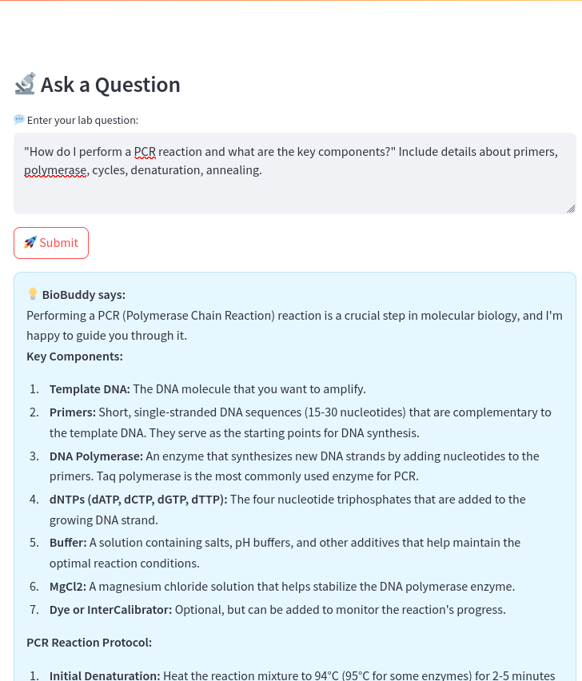

# 🧬 BioBuddy — AI Lab Assistant for Molecular Biology and HPC

## Project Description


**BioBuddy** is an interactive lab assistant built with FastAPI and Streamlit. It supports researchers and students in biology and HPC environments by:

- Answering lab-specific and HPC-related questions using a GWDG-hosted LLM
- Providing experimental protocols in detail (e.g., gel electrophoresis, PCR), reagent calculations, safety checks, and troubleshooting
- Classifying biological images using ResNet50
- Supporting newcomers to Professor Julian Kunkel’s group and GWDG

---

This version focuses on text-based assistance and optional document upload — no image classification is included in this version.

---

## 🚀 Features

- 🔬 **AI-Powered Q&A** — Get detailed responses for bio lab protocols and HPC usage
- 🧠 **LLM Integration** — Uses `meta-llama-3.1-8b-instruct` via the GWDG API
- 🖼️ **Image Classification** — Classify uploaded images using ResNet50 (ImageNet-trained)
- 📂 **Streamlit Frontend** — Simple, responsive UI with chat and history
- ⚙️ **FastAPI Backend** — Robust backend for both text and image endpoints

---

## 📂 Folder Structure

biobuddy/
├── backend/
│ └── main.py # FastAPI app
├── frontend/
│ └── app.py # Streamlit interface
├── static/ # Screenshots & media
├── requirements.txt # Project dependencies
├── .env # API keys (not committed)
├── README.md # Project documentation


## ## 📸 Example Results

These are real screenshots of BioBuddy responses and predictions:

### 1. 1X TAE Buffer Preparation  
📄 Protocol steps for preparing 1X TAE buffer for electrophoresis  


---

### 2. DNA Extraction Protocol  
📄 Step-by-step guide for performing DNA extraction  


---

### 3. Lustre in HPC  
📄 Explanation of the Lustre file system for high-performance computing  


---

### 4. SLURM Job Submission  
📄 BioBuddy explains how to submit jobs using SLURM with example scripts  


---

### 5. Agarose Gel Electrophoresis  
📄 Detailed lab protocol for performing gel electrophoresis  


---

### 6. Cell Culture Media Classification  
🧪 Image classification using ResNet50 — predicted media flask from uploaded image  


---

### 7. Key Skills for HPC  
📄 Overview of skills required for a successful HPC career path  


---

### 8. PCR (Polymerase Chain Reaction) Protocol  
📄 Step-by-step explanation of PCR setup and cycling conditions  


---


## 🧪 Technologies Used

| Component     | Description                             |
|---------------|-----------------------------------------|
| **FastAPI**   | Backend API with image and text routes  |
| **Streamlit** | Frontend UI for question input + upload |
| **PyTorch**   | ResNet50 image classification           |
| **GWDG API**  | LLM-based Q&A model (meta-llama-3.1)    |
| **httpx**     | Async HTTP client for model calls       |
| **PIL**       | Image processing for uploads            |


---

## ⚙️ How to Run

### Prerequisites


## Installation & Setup

- Python 3.8+

1. **Clone the repository**

```bash
git clone https://github.com/majidbahader/biobuddy.git

cd biobuddy

#Create and activate virtual environment

python3 -m venv venv
source venv/bin/activate  # Linux

# Install dependencies

pip install -r requirements.txt

Set up environment variables

Create a .env file in the root folder and add:

GWDG_API_KEY= gwdg_api_key

Usage
1. Run Backend

uvicorn backend.main:app --reload

2. Run Frontend

streamlit run frontend/app.py

How to Use

    Open the Streamlit app in your browser.

    Type your lab-related question.

    Optionally upload a file to support your query.

    Get real-time answers from the assistant.

Contributing

    Fork the repository

    Create a new branch: git checkout -b feature-branch

    Make your changes

    Commit: git commit -m "Add feature"

    Push: git push origin feature-branch

    Open a Pull Request

Future Plans

    🔄 Integrate lab document parsing (PDFs, protocols)

    🔐 Add user login and session-based history

    📊 Support for reagent and buffer calculators

    🧪 Protocol templates and visualization